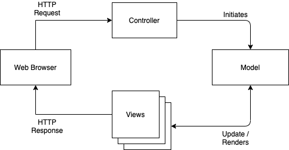
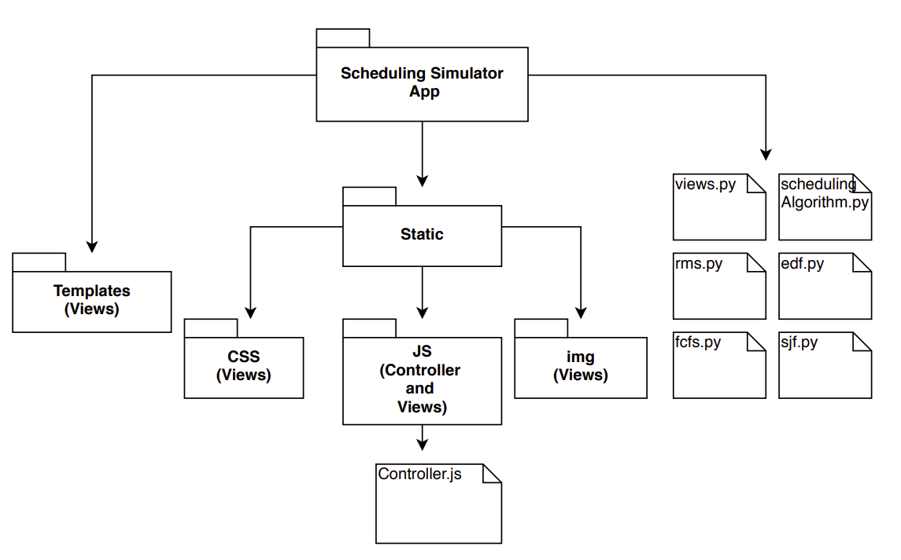

# Architecture
The model used for the Simulator is based on the Model-View-Controller architecture (MVC)[1] using Django Framework as shown in the Figure below. A user request is handled in the following way:
- The client enters the necessary tasks and submits on the Web browser which then sends a request for a page to the controller on the server.
- The controller retrieves the data it needs from the model, i.e, the scheduling algorithms are triggered, the model takes the input that's required from the controller and performs its execution and then sends the output to the controller, to respond to the request.
- The controller gives the retrieved data from the model to the view.
- The view is rendered and sent back to the client for the browser to display.
In the simulator, the model comprises the implementation of the scheduling algorithms used in the simulator in Python. The controller is the JavaScript file that interacts with the model using JSON. Views are the HTML, CSS, JS files which are used to design the entire web page consisting of graphs, tables, etc.

As shown in the Figure below all the python files are the Model, the Controller is a JavaScript file in the Static/JS folder, the templates, the CSS, other JS files and images all belong to the View.

## References
1. E. Okuyan and B. Kayayurt, "Earliest deadline first scheduling algorithm and its use in ANKA UAV," 2012 IEEE/AIAA 31st Digital Avionics Systems Conference (DASC), Williamsburg, VA, 2012, pp. 8B1-1-8B1-8, doi: 10.1109/DASC.2012.6382435.