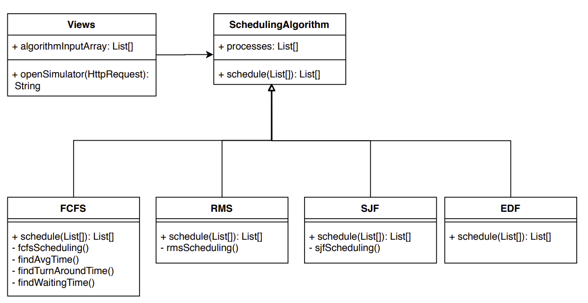

# Class Diagram

Figure below explains the class files and the functions involved in the simulator. The view is a callable that takes a request and returns a response to and from the controller. The view invokes the scheduling algorithm, which is inherited by all the scheduling algorithms implementations. Each of these implementations executes the algorithm for a given input and returns the control to view.

